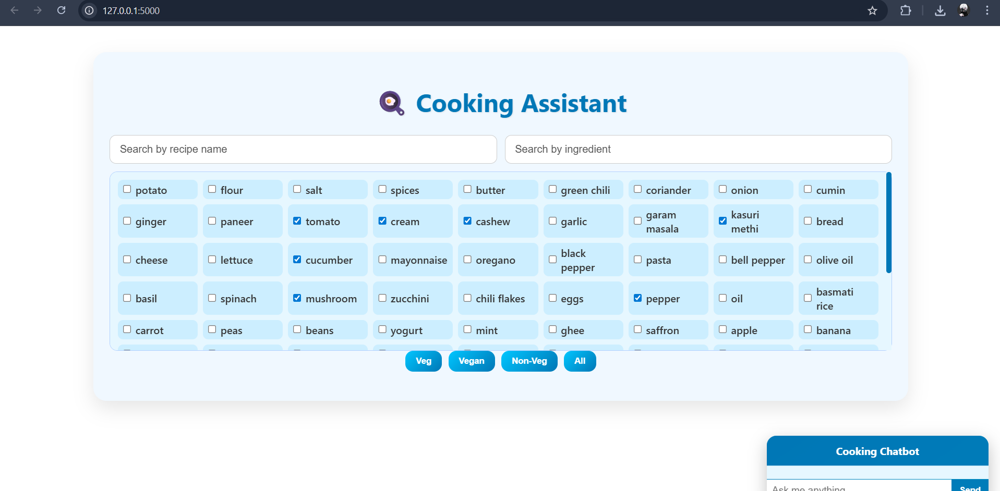

<div align="center">

# 🍳 ChefAI — Cooking Assistant

### *Discover recipes, filter by diet, and chat with an AI chef — all in one place.*

[](https://python.org)
[](https://flask.palletsprojects.com)
[](https://ai.google.dev)
[](LICENSE)
[](CONTRIBUTING.md)
[]()

</div>

---

## 🚀 Product Overview

**ChefAI** is a lightweight, AI-powered cooking assistant web app built with **Flask** and **Google Gemini 2.5 Flash Lite**. It helps users discover Indian recipes, filter by dietary type, search by ingredient, and chat with an intelligent assistant that answers cooking queries in real time.

The chatbot first tries to match recipes locally from a structured JSON dataset — and seamlessly falls back to Gemini AI for open-ended culinary questions, substitutions, and tips.

> From *"what can I make with paneer and spinach?"* to *"how do I make a perfect dosa batter?"* — ChefAI has it covered.

---

## ✨ Features

- 🔍 **Dual Search** — Search recipes by name or individual ingredient simultaneously
- 🥦 **Dietary Filters** — One-click filtering for Veg, Vegan, and Non-Veg meals
- ☑️ **Ingredient Checkboxes** — Multi-select ingredient panel for precision filtering
- 🎥 **Video Links** — Embedded YouTube video buttons on each recipe card
- 🤖 **Smart AI Chatbot** — Local recipe matching first; falls back to Gemini 2.5 Flash Lite for anything else
- ⚡ **No-Cache Fresh Data** — Recipes reload live from `recipes.json` on every request
- 📱 **Responsive UI** — Clean, mobile-friendly interface with gradient card design

---

## 🏗️ Tech Stack

| Layer | Technology |
|---|---|
| **Backend** | Python 3.10+, Flask |
| **AI / LLM** | Google Gemini 2.5 Flash Lite (`google-generativeai`) |
| **Frontend** | HTML5, CSS3 (Flexbox/Grid), Vanilla JavaScript |
| **Data** | JSON flat-file (`recipes.json`) |
| **Config** | `python-dotenv` |
| **Package Mgmt** | pip + virtualenv |

---

## 📁 Project Structure

```
chefai/
├── app.py                  # Flask app — routes, chatbot logic, Gemini integration
├── recipes.json            # Recipe dataset (16 Indian recipes)
├── requirements.txt        # Python dependencies
├── .env                    # Environment variables (not committed)
├── templates/
│   └── index.html          # Main UI template
└── static/
    └── images/             # Recipe images (e.g. alooparatha.jpg)
```

---

## 📸 Screenshots
| Recipe Search & Filter | Ingredient Panel | AI Chatbot |
|:---:|:---:|:---:|
|  | `[Screenshot Placeholder]` | `[Screenshot Placeholder]` |

---

## ⚙️ Installation & Setup

### Prerequisites

- Python 3.10 or higher
- A valid [Google Gemini API key](https://ai.google.dev)
- `pip` and `virtualenv`

### 1. Clone the Repository

```bash
git clone https://github.com/your-username/chefai.git
cd chefai
```

### 2. Create & Activate a Virtual Environment

```bash
# Create virtualenv
python -m venv venv

# Activate — macOS/Linux
source venv/bin/activate

# Activate — Windows
venv\Scripts\activate
```

### 3. Install Dependencies

```bash
pip install -r requirements.txt
```

### 4. Configure Environment Variables

Create a `.env` file in the project root:

```env
GEMINI_API_KEY=your_gemini_api_key_here
```

Then update `app.py` to load it securely:

```python
from dotenv import load_dotenv
load_dotenv()

genai.configure(api_key=os.getenv("GEMINI_API_KEY"))
```

> 🔐 **Never hardcode your API key.** Always use `.env` and ensure `.env` is listed in `.gitignore`.

### 5. Run the App

```bash
python app.py
```

Open your browser: **[http://127.0.0.1:5000](http://127.0.0.1:5000)**

---

## 🔗 API Endpoints

| Method | Endpoint | Description |
|---|---|---|
| `GET` | `/` | Renders the main recipe UI (`index.html`) |
| `GET` | `/recipes.json` | Returns the full recipe dataset as JSON (no-cache) |
| `POST` | `/chat` | Accepts `{ "message": "..." }`, returns AI chatbot reply |

### `/chat` — Request & Response

**Request:**
```json
POST /chat
Content-Type: application/json

{
  "message": "What can I make with paneer and tomato?"
}
```

**Response:**
```json
{
  "reply": "You can make Paneer Butter Masala using paneer, tomato.\nSteps: Sauté onion, tomato, garlic..."
}
```

**Chatbot Logic:**
1. Checks if the message matches any recipe name or ingredient in `recipes.json`
2. If matched → returns local recipe steps + missing ingredient suggestions
3. If no match → falls back to **Gemini 2.5 Flash Lite** for a generative response

---

## 🍽️ Recipe Dataset

The app ships with **16 Indian recipes** across three dietary types:

| Type | Examples |
|---|---|
| 🟢 **Veg** | Aloo Paratha, Paneer Butter Masala, Masala Dosa, Palak Paneer, Pav Bhaji |
| 🌿 **Vegan** | Veggie Pasta, Fruit Salad, Tomato Soup, Poha, Hakka Noodles |
| 🍗 **Non-Veg** | Omelette |

Each recipe entry in `recipes.json` includes:

```json
{
  "name": "Paneer Butter Masala",
  "type": "Veg",
  "time": "40 mins",
  "ingredients": ["paneer", "tomato", "cream", "..."],
  "steps": "Sauté onion, tomato...",
  "video": "https://youtu.be/...",
  "image": "static/images/paneer_butter_masala.jpg"
}
```

---

## 🧪 Testing

Run the test suite with:

```bash
pip install pytest
pytest tests/
```

**Recommended test cases:**
- `/chat` with a known recipe name → should return local match
- `/chat` with an unknown query → should return Gemini response
- `/recipes.json` → should return valid JSON array with no caching
- Ingredient filter logic with multiple checkboxes selected

---

## 🚀 Deployment

### Deploy to Render (Recommended — Free Tier)

1. Push your repo to GitHub
2. Connect to [Render](https://render.com) → New Web Service
3. Set **Build Command:** `pip install -r requirements.txt`
4. Set **Start Command:** `python app.py`
5. Add `GEMINI_API_KEY` under Environment Variables
6. Deploy 🎉

### Deploy with Docker

```dockerfile
FROM python:3.11-slim
WORKDIR /app
COPY . .
RUN pip install -r requirements.txt
EXPOSE 5000
CMD ["python", "app.py"]
```

```bash
docker build -t chefai .
docker run -p 5000:5000 --env-file .env chefai
```

---

## 🛣️ Roadmap

- [ ] 🔐 Move API key fully to `.env` with dotenv (security hardening)
- [ ] 🧑‍🍳 User accounts & saved favourite recipes
- [ ] 📊 Nutritional information per recipe
- [ ] 🌍 Multi-cuisine & multi-language support
- [ ] 🛒 Auto-generated grocery lists from selected recipes
- [ ] 📲 Progressive Web App (PWA) support
- [ ] 🗄️ Migrate from JSON flat-file to SQLite / PostgreSQL
- [ ] 💬 Conversational chat history (multi-turn Gemini sessions)

---

## 🤝 Contributing

Contributions are warmly welcome! Here's how to get started:

1. Fork the repository
2. Create your feature branch: `git checkout -b feature/your-feature-name`
3. Commit your changes: `git commit -m 'feat: add some feature'`
4. Push to the branch: `git push origin feature/your-feature-name`
5. Open a Pull Request

Please make sure your code follows existing style conventions and includes appropriate comments.

---

## ⚠️ Security Notice

> This project may contain a **hardcoded API key** in `app.py`. Before pushing to any public repository, remove it and load it via environment variables using `python-dotenv`.

```python
# ✅ Do this instead
import os
from dotenv import load_dotenv
load_dotenv()
genai.configure(api_key=os.getenv("GEMINI_API_KEY"))
```

---

## 📄 License

Distributed under the **MIT License**. See [`LICENSE`](LICENSE) for full details.

---

<div align="center">

Made with ❤️ and a lot of 🍛 · Powered by Flask & Google Gemini

*Star ⭐ this repo if ChefAI helped you find your next favourite meal!*

</div>
